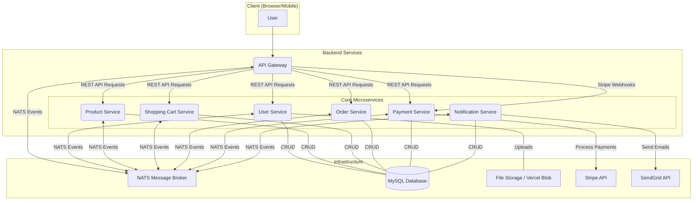

# E-Commerce Platform - Microservices Architecture

This project is a fully-featured e-commerce platform built with a modern, scalable, and maintainable microservices architecture. Each core feature of the platform is encapsulated within its own independent service, promoting separation of concerns and enabling independent development and deployment.

The entire application is containerized using Docker and orchestrated with Docker Compose, making local setup and deployment straightforward. Communication between services is handled asynchronously via a NATS message broker, ensuring resilience and high performance.

## Architecture Diagram

The following diagram illustrates the high-level architecture of the system, showing how clients interact with the API Gateway and how the services communicate with each other.



## Tech Stack

This project utilizes a range of modern technologies to deliver a robust and scalable solution.

| Category              | Technology                                                                                             |
| --------------------- | ------------------------------------------------------------------------------------------------------ |
| **Backend Framework** | [NestJS](https://nestjs.com/) (TypeScript)                                                             |
| **Database**          | [MySQL](https://www.mysql.com/) with [TypeORM](https://typeorm.io/)                                      |
| **Architecture**      | Microservices                                                                                          |
| **Communication**     | [NATS.io](https://nats.io/) Message Broker                                                             |
| **Containerization**  | [Docker](https://www.docker.com/) & [Docker Compose](https://docs.docker.com/compose/)                 |
| **API Gateway**       | Custom NestJS Gateway                                                                                  |
| **Authentication**    | JWT, Passport.js (Local Strategy, Google OAuth)                                                        |
| **Payments**          | [Stripe](https://stripe.com/)                                                                          |
| **Notifications**     | [SendGrid](https://sendgrid.com/) for Email                                                            |
| **File Storage**      | [Vercel Blob](https://vercel.com/storage/blob)                                                         |
| **Code Quality**      | [ESLint](https://eslint.org/) & [Prettier](https://prettier.io/)                                         |

## Microservices Overview

Each service is a self-contained NestJS application with its own responsibilities.

| Service               | Port | Description                                                                                                                            |
| --------------------- | :--: | -------------------------------------------------------------------------------------------------------------------------------------- |
| **API Gateway**       | 3001 | The single entry point for all client requests. Handles request validation, authentication (JWT), and routing to the appropriate microservice. |
| **User Service**      |  -   | Manages user accounts, profiles, addresses, and authentication (registration, login, password management).                               |
| **Product Service**   |  -   | Responsible for managing the product catalog, including categories, product details, pricing, and inventory.                             |
| **Shopping Cart**     |  -   | Manages the user's shopping cart, allowing items to be added, updated, and removed.                                                    |
| **Order Service**     |  -   | Handles the order creation process, order history, and status tracking.                                                                |
| **Payment Service**   |  -   | Integrates with Stripe to process payments for orders and handles payment-related events and webhooks.                                   |
| **Notification Service**|  -   | Sends asynchronous notifications to users, such as email confirmations for orders and account-related activities, using SendGrid.      |

## Getting Started

### Prerequisites

- [Docker](https://www.docker.com/get-started) and [Docker Compose](https://docs.docker.com/compose/install/) installed on your local machine.
- A `.env` file configured with the necessary environment variables.

### Installation & Setup

1.  **Clone the repository:**
    ```bash
    git clone https://github.com/your-username/your-repo-name.git
    cd your-repo-name
    ```

2.  **Create Environment Files:**
    Each service may require its own environment variables (e.g., for database credentials, API keys, etc.). You will need to create a `.env` file in the root directory of each microservice (`api-gateway`, `user-service`, etc.).

    A typical configuration in `docker-compose.yml` relies on these variables. You should add environment variables for:
    - `DATABASE_URL` or individual DB params (`HOST`, `PASSWORD`, etc.)
    - `STRIPE_API_KEY`, `STRIPE_WEBHOOK_SECRET`
    - `SENDGRID_API_KEY`
    - `JWT_SECRET`
    - Vercel Blob Storage tokens

3.  **Build and Run the Application:**
    Use Docker Compose to build the images and start all the services in detached mode.

    ```bash
    docker-compose up --build -d
    ```

4.  **Accessing the Application:**
    - The **API Gateway** will be available at `http://localhost:3001`.
    - The **NATS** server can be monitored at `http://localhost:4222`.
    - The **MySQL** database is exposed on port `3307`.

### Running Services
- To view logs for all services: `docker-compose logs -f`
- To view logs for a specific service: `docker-compose logs -f <service_name>`
- To stop all services: `docker-compose down`

---

