# E-Commerce Platform - Microservices Architecture

A modern, scalable e-commerce platform built with microservices architecture, featuring containerized services, event-driven communication, and seamless third-party integrations.

## 🏗️ Architecture Overview

Our platform follows a distributed microservices architecture where each service handles a specific business domain. The API Gateway serves as the single entry point, orchestrating communication between services through both synchronous REST calls and asynchronous event messaging.

```mermaid
graph TB
    subgraph "Client Layer"
        Client[🌐 Client Applications<br/>Web, Mobile, etc.]
    end
    
    subgraph "External Services"
        Stripe[💳 Stripe<br/>Payment Processing]
        SendGrid[📧 SendGrid<br/>Email Delivery]
        VercelBlob[📁 Vercel Blob<br/>File Storage]
    end
    
    subgraph "Platform Infrastructure"
        APIGateway[🚪 API Gateway<br/>:3001]
        
        subgraph "Core Microservices"
            UserService[👤 User Service<br/>Authentication & Profiles]
            ProductService[📦 Product Service<br/>Catalog & Inventory]
            CartService[🛒 Shopping Cart Service<br/>Cart Management]
            OrderService[📋 Order Service<br/>Order Processing]
            PaymentService[💰 Payment Service<br/>Payment Logic]
            NotificationService[🔔 Notification Service<br/>Email & Alerts]
        end
        
        subgraph "Infrastructure Services"
            NATS[⚡ NATS Message Broker<br/>:4222]
            MySQL[(🗄️ MySQL Database<br/>:3307)]
        end
    end
    
    %% Client connections
    Client -->|HTTP/REST| APIGateway
    
    %% API Gateway to Services
    APIGateway -.->|Route Requests| UserService
    APIGateway -.->|Route Requests| ProductService
    APIGateway -.->|Route Requests| CartService
    APIGateway -.->|Route Requests| OrderService
    
    %% External Service Integrations
    APIGateway <-->|File Upload/Download| VercelBlob
    PaymentService <-->|Process Payments| Stripe
    Stripe -.->|Webhooks| APIGateway
    NotificationService -->|Send Emails| SendGrid
    
    %% Event-driven communication
    UserService <-->|Events| NATS
    ProductService <-->|Events| NATS
    CartService <-->|Events| NATS
    OrderService <-->|Events| NATS
    PaymentService <-->|Events| NATS
    NotificationService <-->|Events| NATS
    APIGateway -.->|Webhook Events| NATS
    
    %% Database connections
    UserService <-->|CRUD| MySQL
    ProductService <-->|CRUD| MySQL
    CartService <-->|CRUD| MySQL
    OrderService <-->|CRUD| MySQL
    PaymentService <-->|CRUD| MySQL
    
    %% Styling
    classDef serviceBox fill:#e1f5fe,stroke:#01579b,stroke-width:2px
    classDef externalBox fill:#f3e5f5,stroke:#4a148c,stroke-width:2px
    classDef infraBox fill:#e8f5e8,stroke:#1b5e20,stroke-width:2px
    classDef gatewayBox fill:#fff3e0,stroke:#e65100,stroke-width:3px
    
    class UserService,ProductService,CartService,OrderService,PaymentService,NotificationService serviceBox
    class Stripe,SendGrid,VercelBlob externalBox
    class NATS,MySQL infraBox
    class APIGateway gatewayBox
```



## 🚀 Key Features

- **Microservices Architecture**: Each service is independently deployable and scalable
- **Event-Driven Communication**: Asynchronous messaging via NATS for loose coupling
- **API Gateway Pattern**: Single entry point with request routing and authentication
- **Payment Integration**: Secure payment processing with Stripe webhooks
- **File Management**: Image and document storage via Vercel Blob
- **Email Notifications**: Automated email delivery through SendGrid
- **OAuth Authentication**: Google OAuth integration alongside traditional auth
- **Containerized Deployment**: Full Docker support with Docker Compose orchestration

## 🛠️ Technology Stack

| Category | Technology | Purpose |
|----------|------------|---------|
| **Runtime** | Node.js + TypeScript | Server-side JavaScript with type safety |
| **Framework** | NestJS | Scalable Node.js framework with decorators |
| **Database** | MySQL + TypeORM | Relational database with ORM |
| **Message Broker** | NATS.io | High-performance messaging system |
| **Containerization** | Docker + Compose | Application containerization and orchestration |
| **Authentication** | JWT + Passport.js | Token-based auth with OAuth strategies |
| **Payments** | Stripe API | Payment processing and webhooks |
| **Email** | SendGrid API | Transactional email delivery |
| **File Storage** | Vercel Blob | Cloud-based file storage |
| **Code Quality** | ESLint + Prettier | Linting and code formatting |


## 📊 Microservices Overview

Each service is a self-contained NestJS application with its own responsibilities.

| Service               | Port | Description                                                                                                                            |
| --------------------- | :--: | -------------------------------------------------------------------------------------------------------------------------------------- |
| **API Gateway**       | 3001 | The single entry point for all client requests. Handles request validation, authentication (JWT), and routing to the appropriate microservice. |
| **User Service**      |  -   | Manages user accounts, profiles, addresses, and authentication (registration, login, password management).                               |
| **Product Service**   |  -   | Responsible for managing the product catalog, including categories, product details, pricing, and inventory.                             |
| **Shopping Cart**     |  -   | Manages the user's shopping cart, allowing items to be added, updated, and removed.                                                    |
| **Order Service**     |  -   | Handles the order creation process, order history, and status tracking.                                                                |
| **Payment Service**   |  -   | Integrates with Stripe to process payments for orders and handles payment-related events and webhooks.                                   |
| **Notification Service**|  -   | Sends asynchronous notifications to users, such as email confirmations for orders and account-related activities, using SendGrid.      |

## 🚦 Getting Started

### Prerequisites

Ensure you have the following installed on your development machine:

- **Docker** (v20.10+) and **Docker Compose** (v2.0+)
- **Node.js** (v18+) - for local development
- **Git** - for version control

### Environment Configuration

Create a `.env` file in each service directory with the following variables:

```bash
# Database Configuration
DB_HOST=mysql_db
DB_USER=ecommerce_user
DB_PASSWORD=secure_password_123
DB_NAME=ecommerce_db
DB_PORT=3306

# JWT & Security
JWT_SECRET=your-super-secure-jwt-secret-key-here
PASSWORD_RESET_SECRET=your-password-reset-secret-key

# Google OAuth
GOOGLE_CLIENT_ID=your-google-oauth-client-id
GOOGLE_CLIENT_SECRET=your-google-oauth-client-secret
GOOGLE_CALLBACK_URL=http://localhost:3001/auth/google/callback

# Stripe Payment Gateway
STRIPE_SECRET_KEY=sk_test_your_stripe_secret_key
STRIPE_PUBLISHABLE_KEY=pk_test_your_stripe_publishable_key
STRIPE_WEBHOOK_SECRET=whsec_your_webhook_endpoint_secret

# SendGrid Email Service
SENDGRID_API_KEY=SG.your_sendgrid_api_key
SENDGRID_SENDER_EMAIL=noreply@yourdomain.com
SENDGRID_SENDER_NAME=Your E-Commerce Store

# Vercel Blob Storage
BLOB_READ_WRITE_TOKEN=vercel_blob_your_read_write_token

# Application Settings
FRONTEND_URL=http://localhost:3000
API_BASE_URL=http://localhost:3001
NODE_ENV=development

# NATS Configuration
NATS_URL=nats://nats-server:4222
```

### 🔧 Installation & Setup

1. **Clone the repository:**
   ```bash
   git clone https://github.com/yourusername/ecommerce-microservices.git
   cd ecommerce-microservices
   ```

2. **Set up environment variables:**
   ```bash
   # Copy environment template to each service
   cp .env.example api-gateway/.env
   cp .env.example user-service/.env
   cp .env.example product-service/.env
   # ... repeat for all services
   ```

3. **Build and start all services:**
   ```bash
   docker-compose up --build -d
   ```

4. **Verify services are running:**
   ```bash
   docker-compose ps
   ```

### 📍 Service Endpoints

Once the application is running, you can access:

| Service | URL | Description |
|---------|-----|-------------|
| API Gateway | http://localhost:3001 | Main API endpoint |
| API Documentation | http://localhost:3001/api-docs | Swagger/OpenAPI docs |
| NATS Monitor | http://localhost:4222 | NATS server monitoring |
| MySQL Database | localhost:3307 | Database connection |

### 🧪 Testing the Setup

```bash
# Health check
curl http://localhost:3001/health

# User registration
curl -X POST http://localhost:3001/auth/register \
  -H "Content-Type: application/json" \
  -d '{"email":"test@example.com","password":"password123","firstName":"John","lastName":"Doe"}'

# Get products
curl http://localhost:3001/products
```

## 📈 Event Flow Examples

### Order Processing Flow


## 🔧 Development Commands

```bash
# Start services in development mode
docker-compose -f docker-compose.dev.yml up

# View logs for specific service
docker-compose logs -f user-service

# Stop all services
docker-compose down

# Rebuild specific service
docker-compose build --no-cache product-service

# Run database migrations
docker-compose exec api-gateway npm run typeorm:migration:run
```

## 📚 API Documentation

Interactive API documentation is available at `http://localhost:3001/api-docs` when the services are running. This includes detailed information about:

- Authentication endpoints
- User management
- Product catalog
- Shopping cart operations
- Order processing
- Payment handling

## 🤝 Contributing

1. Fork the repository
2. Create a feature branch (`git checkout -b feature/amazing-feature`)
3. Commit your changes (`git commit -m 'Add amazing feature'`)
4. Push to the branch (`git push origin feature/amazing-feature`)
5. Open a Pull Request

## 📄 License

This project is licensed under the MIT License - see the [LICENSE](LICENSE) file for details.

---

*Built with ❤️ using modern microservices architecture*